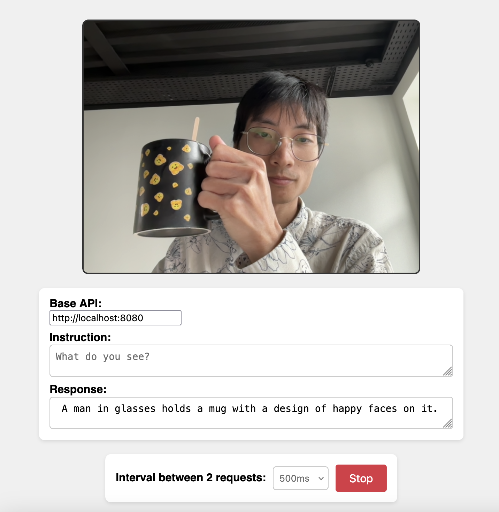

# Real-Time Voice Conversation System (ASR + LLM + TTS) & SmolVLM Camera Demo

This repository now contains two related real‑time demos built on top of `llama.cpp`:

1. Voice Conversation Pipeline (ASR → LLM → TTS) with interruption & latency instrumentation
2. Original SmolVLM real-time camera demo (vision + instruction following)

---
## 1. Voice Conversation System
Low-latency, interruption-aware voice assistant pipeline:

Workflow:
```
Mic → RealtimeSTT → Prompt Build → llama.cpp /completion (SSE) → Token Buffer → Piper TTS → Speaker
          ^                                                           |
          | (pause during prefill)                                    v
    User speech interrupts  <----  Immediate TTS stop & queue flush (barge-in)
```

### Features
- Sub-second target first-token latency with detailed timing breakdown
- Raw byte SSE parsing (optional) for earliest token flush vs line iterator
- HTTP/2 toggle (disable if adding head-of-line blocking or delay)
- Optional ASR pause during LLM prefill to reduce CPU contention
- Sentence-chunk incremental TTS playback (speaks while still generating)
- Instant barge-in (user speech interrupts and flushes audio queue)
- Conversation history summarization & trimming (keeps context small)
- Low latency mode (removes mirostat / typical_p; simpler sampling)
- Tokens/sec generation metrics

### Key File
`asr_llm_tts.py` – class `VoiceConversationSystem`

### Installation
```
pip install -r requirements.txt
```
Ensure you have:
- `llama-server` (from llama.cpp) running locally
- Piper ONNX voice model (e.g. `en_US-hfc_female-medium.onnx`) placed in repo root (gitignored)

### Run
```
python asr_llm_tts.py --llm-url http://localhost:8080 --tts-model en_US-hfc_female-medium.onnx
```
Test components:
```
python asr_llm_tts.py --test
```

### llama.cpp Server Example
```
./llama-server --model ./models/your-model.Q4_K_M.gguf --host 0.0.0.0 --port 8080 \
  --ctx-size 4096 --parallel 2 --no-mmap
```
Tune args for your hardware (quant, threads, ctx-size). For fastest first token, prefer smaller / quantized model.

### Latency Metrics Printed
```
build_prompt
pre_request_gap
network+server_first_byte
first_sse_line_after_send
first_token_latency_total
generation_phase (tokens + tps)
end_to_end
```
Interpretation:
- Large `network+server_first_byte`: server busy / model prefill
- Gap between first_byte and first_sse_line: server buffering before flush
- High pre_request_gap: Python scheduling contention (reduce threads/ASR)

### Optimization Toggles (constructor params)
- `use_http2` (default True)
- `use_raw_stream` (default True) – raw byte parser for minimum buffering
- `pause_asr_during_prefill` (default True)
- `low_latency_mode` (default True) – strips advanced sampling
- `enable_history_summarization` (default True)
- `summarize_after_turns` (default 10)
- `history_trim_threshold` (default 12)

### History Summarization
After threshold, older turns are compressed into a single `Summary:` line (simple truncation). Replace with a smarter summarizer if desired.

### Barge-In
ASR callbacks (`on_recording_start/stop/transcription_start`) immediately:
- Set interruption flags
- Stop / flush TTS queue
- Prevent new TTS until user finishes

### Roadmap Ideas
- CLI flags to expose toggles (currently hardcoded defaults)
- Multiprocessing for TTS to avoid GIL influence on first token
- Smarter semantic summarization using a tiny local model
- WebSocket / browser microphone client integration
- Automated model download / verification script

---
## 2. SmolVLM Real-Time Camera Demo (Original)



Simple demo using `llama.cpp` multimodal support with SmolVLM 500M for real-time object / scene description.

### Setup (Original Instructions)
1. Install [llama.cpp](https://github.com/ggml-org/llama.cpp)
2. Run:
   ```
   llama-server -hf ggml-org/SmolVLM-500M-Instruct-GGUF
   ```
   Notes:
   - Add `-ngl 99` to enable GPU acceleration if available
   - Explore other models in llama.cpp multimodal docs
3. Open `index.html`
4. Optionally change the system / task instruction
5. Click "Start"

---
## Repository Structure (Selected)
```
asr_llm_tts.py        # Voice conversation main system
llm_tts.py            # Earlier LLM→TTS prototype
asr_test.py           # ASR experiments
tts_test.py           # TTS experiments
index.html            # Original camera demo UI
config.py             # Config helpers (if used)
README.md             # This file
requirements.txt      # Python dependencies
*.onnx / *.gguf       # (ignored) place your models here
```

## Large Files / Models
Model binaries are git-ignored. Use Git LFS or a download script if distributing.

## License
See `LICENSE` (add one if missing before publishing publicly).

## Disclaimer
Ensure compliance with model & dataset licenses. Voice data may contain PII – handle responsibly.

---
Happy hacking!
